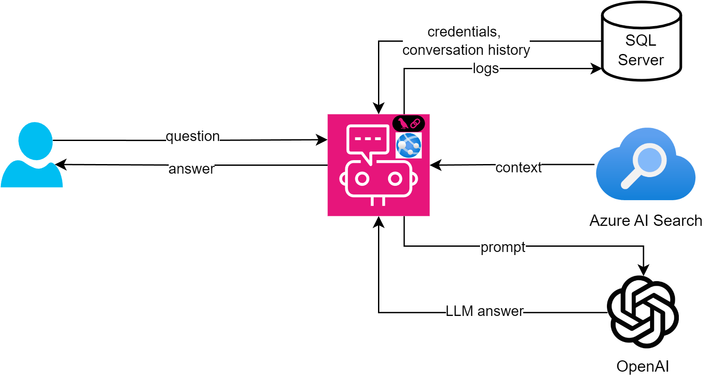

# Resume Chatbot

This project is a chatbot designed to interact with users and answer questions about a specific resume. It leverages OpenAI's language model, LangChain's retrieval tools, and a custom prompt template to generate context-aware responses.



## Features

-   **Resume-Specific Q\&A:** The chatbot is focused on a specific resume, allowing it to answer questions about the candidate's qualifications, skills, and experiences.
-   **Context-Aware Responses:** The chatbot considers the conversation history to provide more relevant and accurate answers.
-   **User Authentication:** Secure user authentication is implemented to control access to the chatbot.
-   **Message Limit:** Each user has a limit on the number of messages they can send, which can be adjusted by the resume owner.
-   **Database Integration:** User information and conversation history are stored in a SQL database.
-   **Azure AI Search:** The resume data is indexed using Azure AI Search for efficient retrieval.
-   **Customizable:** The chatbot's behavior and responses can be customized through prompt engineering.

## Technologies Used

-   **Python:** The primary programming language.
-   **OpenAI API:** For natural language processing and generating responses.
-   **LangChain:** For building language model applications and retrieval tools.
-   **Streamlit:** For creating the web application interface.
-   **Azure AI Search:** For indexing and retrieving resume data.
-   **SQL Server:** For storing user information and conversation history.
-   **Azure Web App Service:** For deploying the application.


## Setup and Installation 

1.  **Clone the repository:**

    ```bash
    git clone <repository_url>
    ```

2.  **Install dependencies:**

    ```bash
    pip install -r requirements.txt

3.  **Create SQL Server Database**

    a.  **Create an Azure SQL Server Instance:** Set up a new instance of Azure SQL Server.

    b.  **Configure Connection String:**
        
    *   Create a `.env` file in the project's root directory.
    *   Add the `SQL_CONN_STR` parameter with your Azure SQL Server connection string.
       **Example:** 
       ```
       SQL_CONN_STR="Driver={ODBC Driver 18 for SQL Server};Server=tcp:your_server_name.database.windows.net,1433;Database=your_database_name;Uid=your_username;Pwd=your_password;Encrypt=yes;TrustServerCertificate=no;Connection Timeout=30;"
       ```
       **Note:** Replace the placeholder values (e.g., `your_server_name`, `your_database_name`, `your_username`, `your_password`) with your actual database credentials.

    c.  **Create Database Tables:**
        
    *   Open the `notebooks/database_creation.ipynb` notebook file.
    *   Run the notebook's cells to execute the SQL commands that will create the necessary tables: `Users` and `ConversationHistory`.

    d.  **Populate the `Users` Table:**
        
    *   Add user data to the `Users` table.
    *   **Methods:**
        *   **Programmatically (Not Included):** You can create a Python script to add users to the database. (This is not implemented in the current project files). You can add this code to the db_manager.py file. 
        *   **Azure Data Studio:** Use Azure Data Studio (or another SQL client) to manually insert user records into the `Users` table.
            


4.  **Create the Azure AI Search Index**

    a.  **Create an Azure AI Search Instance:** Set up a new instance of Azure AI Search within your Azure subscription.

    b.  **Configure .env File with Azure AI Search Credentials:**
        
    *   Open the `.env` file located in the project's root directory.
    *   Add the following parameters, replacing the placeholder values with your actual credentials:
        ```
        AZURE_AI_SEARCH_API_KEY=your_azure_ai_search_api_key
        AZURE_AI_SEARCH_URL='https://your_azure_ai_search_service_name.search.windows.net`
        ```
        **Note:**  `your_azure_ai_search_api_key` needs to be replaced by your real key. And `your_azure_ai_search_service_name` needs to be replaced with your Azure AI search service name.
    
    c.  **Create the Index:**
        
    *   Open the `notebooks/upload_index.ipynb` notebook file.
    *   Locate and copy the JSON script defining the index schema.
    *   Navigate to the Azure portal and access your Azure AI Search instance.
    *   Select the "Add Index (JSON)" option.
    *   Paste the copied JSON script into the provided field.
    *   Create the index.

    d.  **Pre-process the Resume File:**
        
    *   Divide your resume into separate documents, with each document representing a distinct section (e.g., work experience, education, skills).
    *   This strategy ensures that unrelated sections are not combined into the same chunk, thereby improving retrieval performance.
    *   Ensure that the name of each document is representative of its content. This name will be uploaded into the `title` field of the index. This is because the retrieval process applies a hybrid query in Azure AI Search (combining text and vector queries in a single search request), and the `title` field is considered in the query alongside the vector content.
    *   Store the processed files in the `data/splitted` folder.

    e.  **Split and Upload Documents to the Index:**
        
    *   Open the `notebooks/upload_index.ipynb` notebook file.
    *   Run the notebook's cells to execute the scripts for document splitting, embedding, and index uploading.
    *   These scripts will perform the following actions:
        *   Split the resume documents into smaller chunks.
        *   Generate embeddings for each chunk using the specified model.
        *   Upload the processed documents (chunks and their embeddings) to the Azure AI Search index.

5.  **Configure OpenAI Service**

    a.  **Set Up OpenAI Instance:**
        
    *   Ensure you have an active OpenAI account.
    *   Obtain an API key from the OpenAI website.

    b.  **Configure `.env` File with OpenAI Credentials:**
        
    *   Open the `.env` file located in the project's root directory.
    *   Add the following environment variable, replacing the placeholder value with your actual OpenAI API key:

        ```
        OPENAI_API_KEY=your_openai_api_key
        ```
        **Note:** Replace `your_openai_api_key` with your actual OpenAI API key.

6.  **Add the Resume Owner Name in the `.env` File:**

    *   Open the `.env` file located in the project's root directory.
    *   Add the following environment variable, replacing the placeholder value with the actual name of the resume owner:

        ```
        RESUME_OWNER_NAME='Your Name Here'
        ```
        **Note:** Replace `'Your Name Here'` with the actual name of the resume owner (e.g., `RESUME_OWNER_NAME='Boris Dorian Da Silva'`).


7.  **Execute the Application Locally:**

    To run the application locally, execute the following command in your terminal:

    ```bash
    streamlit run app.py
    ```

8.  **Deploy the App to Azure Web App Service:**

    There are several methods for deploying to Azure Web App Service. Here's the approach used in this project:

    a.  **Create an Azure Web App Resource:** In the Azure portal, create a new Web App resource.

    b.  **Add Environment Variables:**
       
    *   Navigate to the "Settings" section of your Web App resource.
    *   Select "Environment variables."
    *   Add all the environment variables defined in your local `.env` file to this section.

    c.  **General Configuration:**
    
    *   Go to "Settings" in your Web App resource.
    *   Select "Configuration," then "Stack settings."
    *   Configure the following settings:
        *   **Stack:** `Python`
        *   **Major Version:** `Python 3`
        *   **Minor Version:** `Python 3.10`
        *   **Startup Command:** `python -m streamlit run app.py --server.port 8000 --server.address 0.0.0.0`

    d. **Deploy to Web App using VS Code:**
    
    *   **Install Extension:** Install the "Azure Resources" extension in Visual Studio Code.
    *   **Sign In:** Log in to Azure using your Azure credentials within VS Code.
    *   **Deploy:**
        
        *   In the VS Code sidebar, open the "Azure" panel.
        *   Expand "App Services."
        *   Right-click on the Azure Web App resource you created earlier.
        *   Select "Deploy to Web App..."
        *   Choose the root directory of your project when prompted.
        *   Confirm the deployment by selecting "Deploy" when the confirmation window ("Are you sure you want to deploy...") appears.   
    

